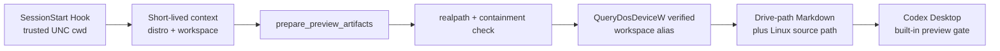

# WSL Native Preview for Codex Desktop

WSL Native Preview turns files in a trusted WSL UNC workspace into Windows drive-path Markdown links that Codex Desktop can open in its built-in previewer. It does not copy the source file.

## Why it exists

A Windows-native Codex task can work in a project opened through `\\wsl.localhost\<distro>\...`, while a generated answer may still contain `/home/<user>/<workspace>/report.md`. Codex Desktop does not consistently route that Linux path to its Windows file previewer. This plugin creates a workspace-scoped DOS-device alias and returns both a tested Windows preview link and the original Linux path.



## Verified matrix

| Component | Verified or supported value |
|---|---|
| Codex Desktop | `26.803.5235.0` |
| Codex | `0.147.0-alpha.6.5` |
| Agent mode | Windows native, non-elevated |
| Workspace | WSL UNC path below a distro root |
| Node.js | 22 and 24 in CI |
| Mapping backend | `subst.exe` DOS-device alias, target-build-gated |
| Working link form | Normal drive-path Markdown |

Newer builds may behave differently. Raw drive text and Markdown `file:///` links failed the original UI gate. MCP ResourceLink transport works at the protocol level but remains an explicit Desktop UI experiment.

## Prerequisites

- Windows with WSL2.
- A Windows-native Codex Desktop task opened from `\\wsl.localhost\<distro>\home\<user>\<workspace>` or `\\wsl$\<distro>\...`.
- Node.js 22 or newer on the Windows `PATH`; Node 22 and 24 are the supported matrix.
- A normal, non-elevated Windows login session.
- One free candidate drive among `W:`, `V:`, `U:`, `T:`, and `S:`.

WSL-agent tasks whose trusted cwd is `/home/...` are not supported. They require a separate Windows-side helper design.

## Install from the rolling channel

Register the Git marketplace in the Codex environment that owns the Desktop configuration:

```bash
codex plugin marketplace add yangyulun111/wsl-native-preview --ref main
```

Then open the Desktop Plugins Directory, choose **WSL Native Preview**, and install it. If your only Codex CLI runs inside WSL, its Linux configuration does not automatically configure Windows Desktop; add the Git marketplace from the Desktop UI instead.

After installation, open `/hooks`, review the current `SessionStart`, `Stop`, and `SessionEnd` definitions, trust their hash, and start a new task in the UNC workspace.

## Install a pinned release

For a reproducible checkpoint:

```bash
codex plugin marketplace add yangyulun111/wsl-native-preview --ref v0.2.0
```

A tag does not perform rollback by itself. To roll back, remove the configured marketplace, add it again pinned to the desired published tag, reinstall the plugin, review the new Hook hash, and start a new task.

## Upgrade

```bash
codex plugin marketplace upgrade yangyulun111-wsl-native-preview
```

Review and trust the Hook hash again after every update. The `main` branch contains only release-ready plugin versions; each plugin change must increment the manifest, package, and lockfile versions.

## Use

The SessionStart Hook injects a short-lived context into the task. Before returning clickable WSL artifacts, the model calls:

- `wsl_preview_status({ contextId? })`
- `prepare_preview_artifacts({ contextId, paths, probeResourceLinks? })`
- `release_preview_mapping({ contextId })`

The normal response format is:

```markdown
[report.md](<V:/relative/path/report.md>) · `/home/<user>/<workspace>/relative/path/report.md`
```

The link target is a Windows drive alias. The visible companion text preserves the original Linux source location.

## Security and isolation

- SessionStart derives the distro and root from trusted Hook input; the model cannot replace them with `/` or another workspace.
- Every file is canonicalized and checked after symbolic-link resolution.
- Files outside the bound workspace, directories, and non-regular files are rejected.
- Native Windows paths and ordinary Windows UNC paths are left unchanged.
- Runtime contexts and mapping ownership use Codex's `PLUGIN_DATA` directory, not the installed plugin tree.
- `release_preview_mapping` removes only a plugin-owned alias whose current `QueryDosDeviceW` target exactly matches the recorded target.
- The plugin has no arbitrary command, file write, edit, or delete MCP tool.

The context identifier is a 256-bit, 24-hour bearer capability. It constrains access to one workspace but is not a user-authentication mechanism.

## Mapping side effects

The working backend invokes `subst.exe` to create a DOS-device alias to the current workspace. On the certified host, `QueryDosDeviceW` reports a target below `\\wsl.localhost\<distro>\...`. This is reported as:

```text
mappingType: dos-device-alias
backend: subst.exe
supportLevel: target-build-gated
```

The alias is user-session state. It is not a filesystem copy, is not guaranteed to survive Desktop or WSL lifecycle changes, and is not automatically removed at SessionEnd so existing chat links do not silently break.

## Behavior and limitations

- **Desktop routing:** MCP does not require a client to open a drive link in its built-in previewer. The verified Desktop build did so; other builds require a new gate.
- **ResourceLink:** protocol reads are capped at 32 MiB and can be probed explicitly, but label, hover, copy, click, and preview behavior are client-defined.
- **Stop correction:** the Hook can request one best-effort continuation when an answer contains a raw WSL link. It cannot rewrite an already rendered message or force an MCP call.
- **Login context:** Desktop and the mapping process must run as the same user, Session ID, and elevation state.

## Uninstall and cleanup

Before uninstalling, ask the plugin to release the current context mapping. It will refuse to remove an unrelated or retargeted drive. Then uninstall the plugin in Desktop and remove the marketplace if it is no longer needed:

```bash
codex plugin marketplace remove yangyulun111-wsl-native-preview
```

See `plugins/wsl-native-preview/docs/CLEANUP.md` for exact manual diagnostics. Do not delete a drive alias unless its current target is the intended WSL workspace.

## Troubleshooting

- **No context:** trust the Hooks and start or resume a new UNC workspace task.
- **MCP unavailable:** confirm Windows Node.js is on `PATH` and `dist/server.mjs` exists in the installed cache.
- **Drive occupied:** the plugin never overwrites an existing local, SUBST, network, or persistent mapping; free a candidate intentionally or change the candidate list in source and retest.
- **Link opens externally:** the Desktop build failed the native-preview UI gate; Skill, MCP, and Hooks cannot install a filesystem provider or intercept the Desktop preview router.
- **Works elevated only or non-elevated only:** launch Desktop and mapping processes in the same security context.

## Development

```bash
cd plugins/wsl-native-preview
npm ci
npm run verify
```

The repository commits `dist/server.mjs` and `dist/hook.mjs`, so a Git marketplace installation needs a Node runtime but does not run `npm install`.
